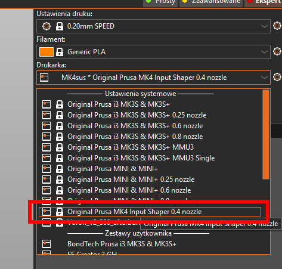
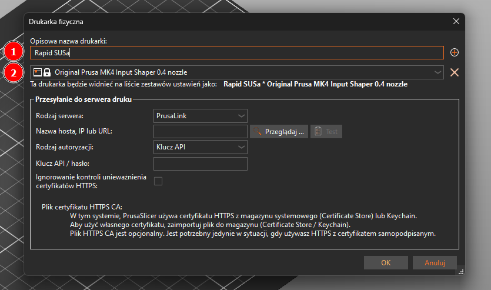
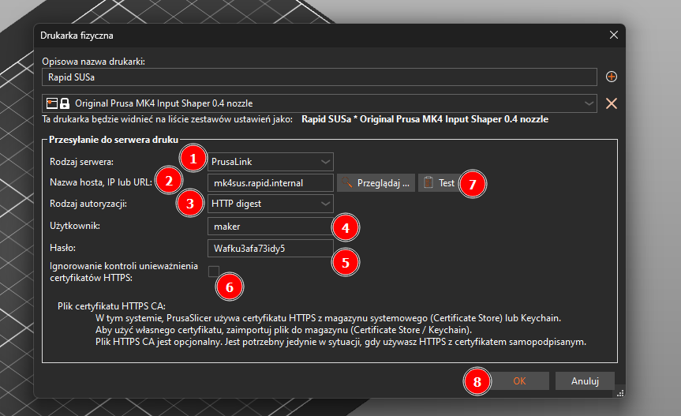
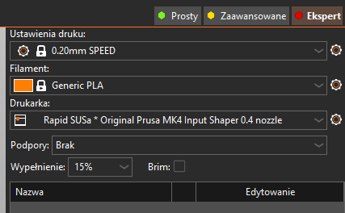
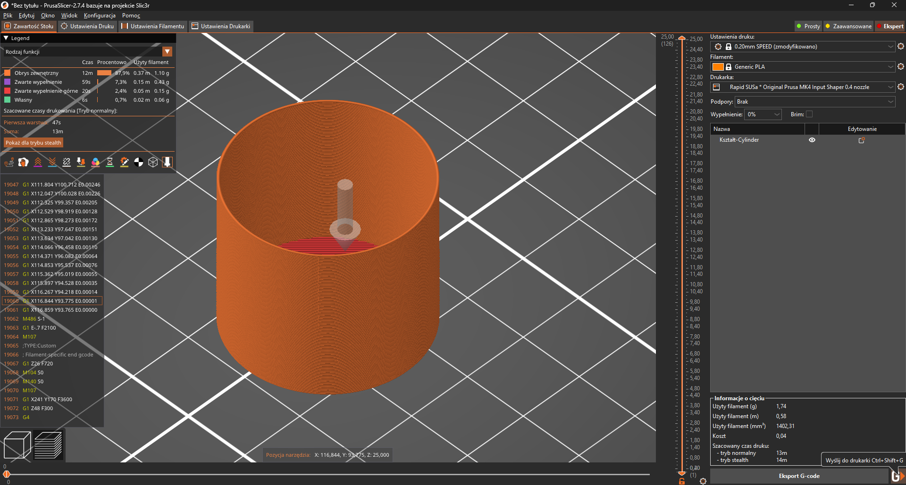
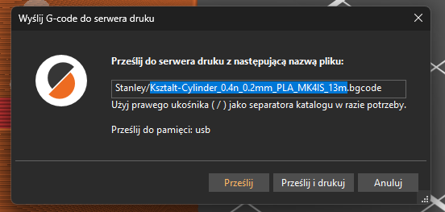
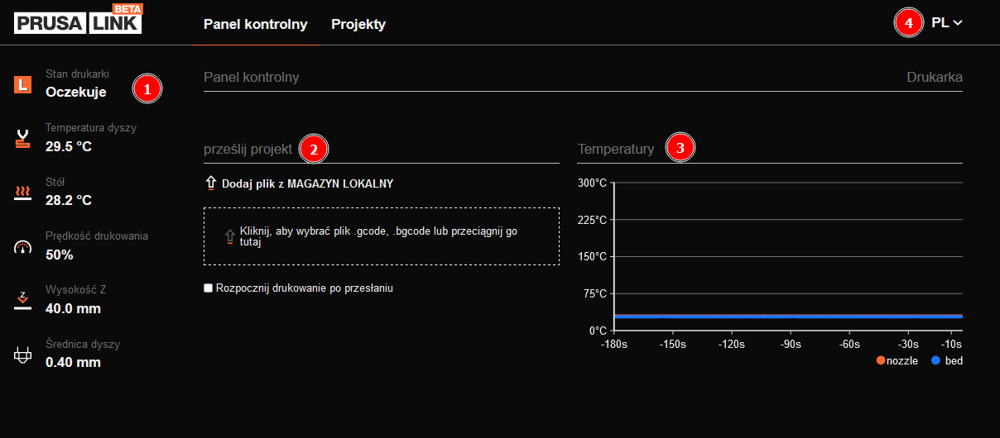
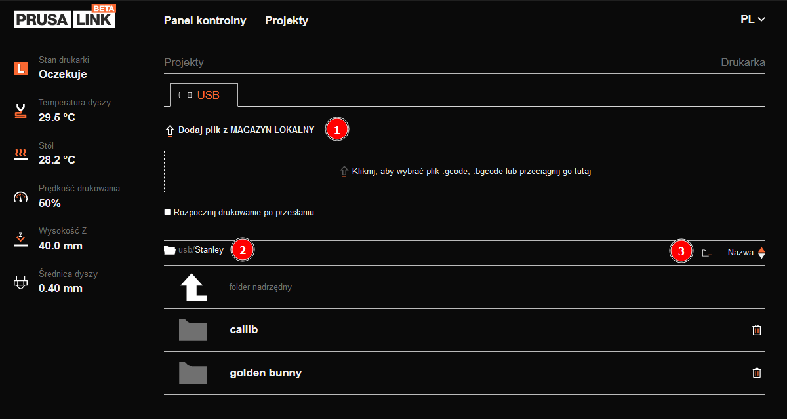
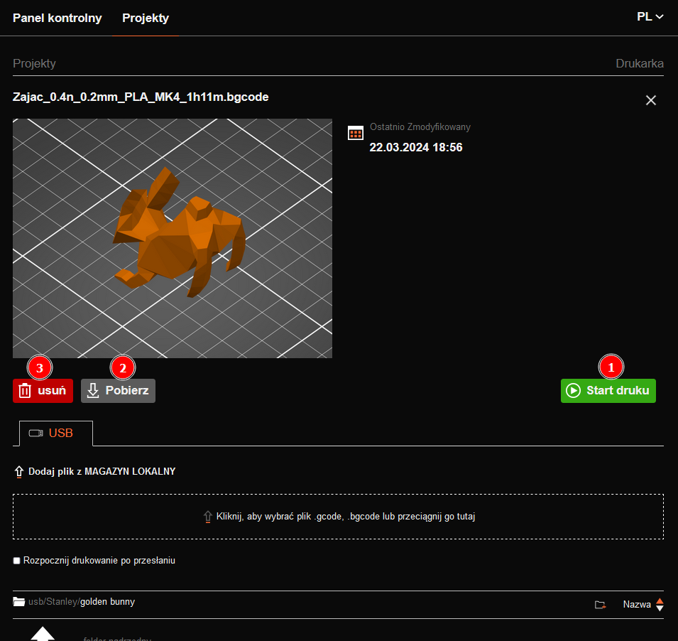

# PrusaLink

PrusaLink to lokalnie działająca usługa hostowana przez drukarkę 3D i umożliwiająca zarówno zdalne drukowanie, jak i zarządzanie maszyną. PrusaLink obsługiwany jest przez wszystkie drukarki 3D Prusa Research z firmware 3.10.0 lub nowszym, z wbudowaną kartą sieciową.

**TL;DR**
PrusaLink jest dostępny na wszystkich Prusach w labie z wyłączeniem Prus MK3

## Before we start

Każde urządzenie podłączone do sieci wewnętrznej ma przypisany statyczny reokrd DNS. W przypadku Prus rekordy te wyglądają następująco:

- Lewy Miniacz: [minil.rapid.internal](http://minil.rapid.internal)
- Prawy Miniacz: [minir.rapid.internal](http://minir.rapid.internal)
- Susa: [mk4sus.rapid.internal](http://mk4sus.rapid.internal)
- MK4 Enclosure: [mk4e.rapid.internal](http://mk4e.rapid.internal)

Każdy z podanych adresów jest podstawowym mechanizmem komunikacji z drukarkami - adresy IP **nie powinny** być używane do konfiguracji **czegokolwiek** w sieci, ze wzglądu na ich zmienność. Adresy z naszego DNSa są stałe, natomiast zawsze powinny prowadzić do aktualnego adresu IP danego urządzenia.

## PrusaSlicer

### Konfiguracja

0. Upewnij się, że w profilach slicera jest zdefiniowany zestaw ustawień (profil) dla modelu drukarki, z którą chcesz się połączyć

1. W slicerze rozwiń ustawienia profili drukarek i wybierz opcję `Dodaj drukarkę fizyczną`

2. Uzupełnij podstawowe informacje o drukarce. O ile nazwa drukarki jest tylko dla ciebie i nie ma absolutnie żadnego znaczenia, to wykorzystywany przez drukarkę profil (2) jest kluczowy - PrusaLink przenosi jedynie pliki i polecenia; slicer nie jest w stanie sprawdzić, na co będziesz ciąć.
  > [!WARNING]
  > **Upewnij się tak z 12 razy**, że wybrany przez ciebie profil jest właściwy. Kiedy będziesz mieć pewność, że jest OK, sprawdź go jeszcze raz.

3. Kolejnym krokiem jest uzupełnienie faktycznych danych połączenia. PrusaSlicer obsługuje różne serwery druku 3D (1), natomiast w naszym przypadku zostawiamy `PrusaLink`. W polu adresu wstawiamy [odpowiedni adres URL](#before-we-start) (2). Ponieważ na dzień pisania tej instrukcji nie dysponujemy jeszcze certyfikatami SSL, wykorzystujemy autoryzację `HTTP digest` (3). PrusaLink zawsze wykorzystuje nazwę użytkownika `maker`, hasło (5) z kolei można znaleźć [tutaj](passes.md). Nie mamy SSL, więc _Ignorowanie kontroli unieważnienia certyfikatów SSL_ (6) nie ma żadnego znaczenia. Dodatkowo możemy jeszcze zweryfikować połączenie (7). Po zakończeniu konfiguracji klikamy `OK` (8).
  > [!IMPORTANT]
  > Przypominam, że podane adresy działają wyłącznie w sieci wewnętrznej, a połączenie z drukarą przez internet możliwe jest przy wykorzystaniu WireGuard'a.

### Zdalne drukowanie przez PrusaSlicer

0. Jeżeli drukujesz spoza laboratorium, sprawdź, czy tunel WireGuard jest aktywny.

1. Wybierz drukarkę, na którą chesz wysłać model

2. Potnij model jak zwykle. Zwróć uwagę na nowy przycisk w prawym dolnym rogu okna

3. Kliknij przycisk `Send to printer` i ustaw odpowiednią scieżkę, na której chesz zapisać plik. Ścieżka jest zapamiętywana między sesjami. Następnie kliknij odpowiedni przycisk przesyłania *and you're done*!
  > [!WARNING]
  > Przed zdalnym puszeczeniem druku sprawdź, co jest na drukarce; niewyczyszczony stół czy zły gatunek filamentu... no tak nie robimy

  > [!IMPORTANT]
  > Przypominam o wrzucaniu plików do swoich folderów

  > [!TIP]
  > Nie musisz drukować od razu - samo przesłanie pliku przenosi .gcode na drukarkę, więc jeżeli np. musisz przygotować hurtowo kilka modeli lub ktoś w labie może ci wydruk puścić jak skończy robić swoje rzeczy (albo po prostu nie chce ci się wstawać od biurka), możesz wrzucić swoje modele do druku z dowolnego miejsca oraz w trakcie drukowania.

## PrusaLink Control Panel
Serwer PrusaLink udostępnia panel zarządzania drukarką. Jest on dość podstawowy, ale pozwala uruchomić wydruk z pendrive'a, przesyłać pliki w obie strony, zarządzać plikami, pauzować i zatrzymywać wydruki oraz monitorować ich postęp czy temperatury.

Login zawsze `maker`, hasło z [listy haseł](passes.md)

> [!CAUTION]
> Lojalnie uprzedzam, że każde połączenie z drukarką jest rejestrowane w zewnętrznym systemie, a każdemu urządzeniu w sieci można selektywnie zabronić dostępu do dowolnego innego urządzenia (lub urządzeń). Oczywiście nikt nie będzie maniakalnie przeglądał kto co kiedy robił, natomiast usuwanie cudzych plików czy wywalanie ludzom wydruków czy trolling przyciskiem 'pause' nie będą tolerowane. Pracujemy na wspólnym sprzęcie, więc szanujmy się nawzajem. TL;DR:
> - Nie bądź głupi
> - NIE bądź głupi
> - Pamiętaj, że szpule plastiku nie rosną na drzewach
> - Da się wyśledzić każdy rozkaz wysłany do drukarki

### Walkthrough
#### Panel Kontrolny

1. Status drukarki
2. Wysyłanie plików (.gcode lub .bgcode)
3. Wykresy temperatur

#### Projekty

1. Wysyłanie plików (.gcode lub .bgcode)
2. Bieżąca lokalizacja
3. `New Folder` i sortowanie listy

Po wybraniu Gcode-u na górze strony pojawia się podgląd modelu (chwilę się pobiera) i podstawowe opcje

1. Uruchomienie druku
2. Pobranie pliku
3. Usunięcie pliku

Happy Printin'!

